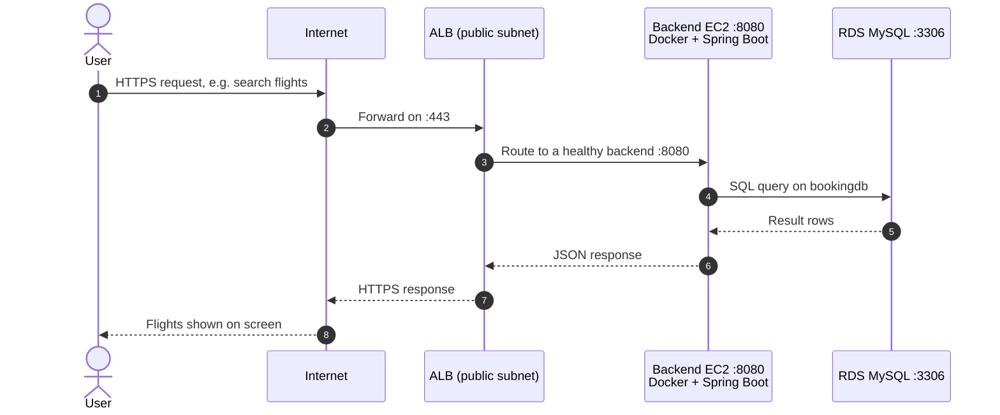
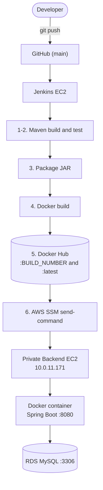
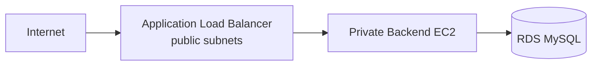
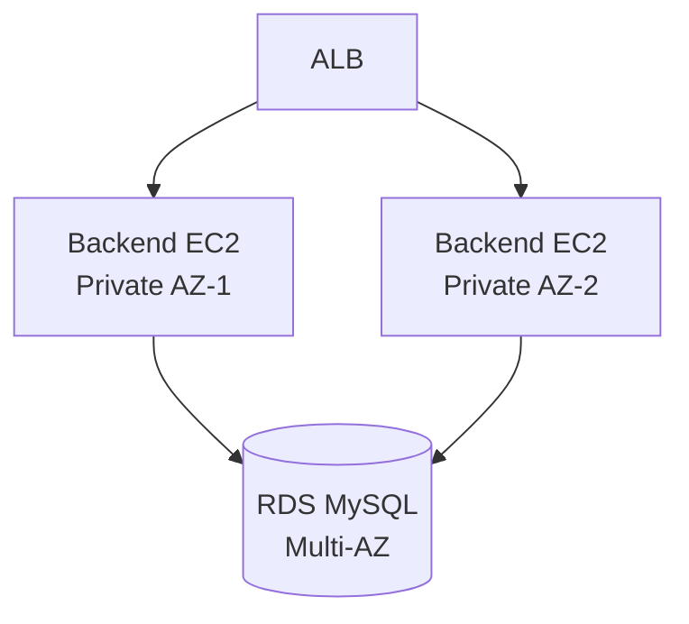
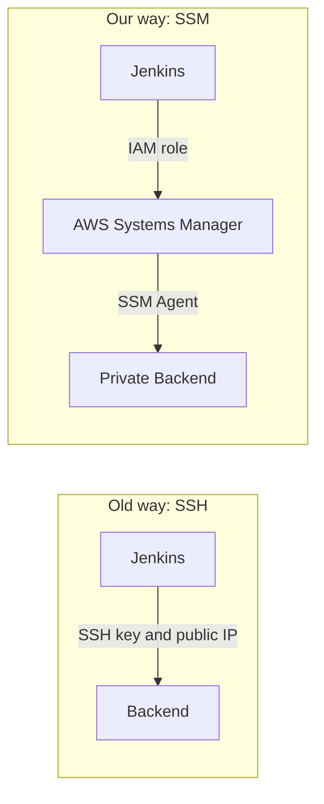

<h1 align="center">✈️ FlightFinder Backend</h1>
<h3 align="center">AWS 3-Tier CI/CD · Production Runbook</h3>

<p align="center">
  
  
  
  
  
  
  
  
</p>

<p align="center">
  
</p>

| | |
|---|---|
| **Repository** | [`FlightFinder-Application_backend`](https://github.com/ajaydhadi95-gif/FlightFinder-Application_backend) (branch `main`) |
| **Maintainer** | [@ajaydhadi95-gif](https://github.com/ajaydhadi95-gif) |
| **Environment** | AWS `ap-south-1` · VPC `10.0.0.0/16` |
| **Current release** | `ajaydhadi95/flightfinder-backend:4` (also tagged `latest`) |
| **Document updated** | 2026-10-06 |

---

## 📑 Table of Contents

| Part | Sections |
|---|---|
| **Understand it** | [1. Explained simply](#1-the-project-explained-simply) · [2. Status at a glance](#2-status-at-a-glance) |
| **Architecture** | [3. Architecture](#3-architecture) · [4. Live user request flow](#4-live-user-request-flow) · [5. CI/CD flow](#5-cicd-flow) |
| **Reference** | [6. Inventory](#6-inventory) · [7. One-time setup](#7-one-time-setup) |
| **Operate it** | [8. Deploy](#8-deploy-a-change) · [9. Verify](#9-verify-a-deployment) · [10. Rollback](#10-rollback) · [11. Daily operations](#11-daily-operations) |
| **Protect it** | [12. Security](#12-security) · [13. Monitoring](#13-monitoring--alerting) · [14. Backup & recovery](#14-backup--disaster-recovery) |
| **Fix it** | [15. Incident playbooks](#15-incident-playbooks) · [16. Issues already solved](#16-issues-already-solved) |
| **Grow it** | [17. Roadmap](#17-roadmap) · [18. FAQ](#18-faq) · [19. Appendix](#19-appendix) |

---

## 1. The Project Explained Simply

> **In one sentence:** when a developer saves new code to GitHub, our system automatically tests it, packs it, and delivers it to a **private, locked-down server** that runs the FlightFinder app and talks to a database.

<p align="center">
  
</p>

### Words you will see in this document

| Word | Plain-English meaning |
|---|---|
| **Backend** | The "brain" of the app. It receives requests (search flights) and sends back answers. |
| **Spring Boot** | The Java framework the backend is written with. |
| **Database (RDS MySQL)** | Where flight and booking data is stored permanently. |
| **AWS** | Amazon's cloud. We rent servers there instead of owning hardware. |
| **EC2** | A rented server (virtual computer) in AWS. |
| **VPC** | Our private network inside AWS, like a fenced compound. |
| **Public subnet** | The part of the compound that faces the street (internet). |
| **Private subnet** | The part with no door to the street. The backend and the database live here. |
| **Docker / container** | A sealed box holding the app and everything it needs, so it runs the same everywhere. |
| **Docker image** | The recipe/blueprint of that box. We number each version (`:1`, `:2`, `:3`, `:4`). |
| **Docker Hub** | An online warehouse that stores our images. |
| **Jenkins** | The robot that builds, tests and ships our code automatically (CI/CD). |
| **CI/CD** | Continuous Integration / Continuous Delivery: automatic build, test and release. |
| **SSM (Systems Manager)** | AWS's secure remote control. Lets Jenkins run commands on the private server **without SSH keys**. |
| **IAM role** | A permission badge given to a server so it can use AWS safely without passwords. |
| **ALB** | Application Load Balancer: the public "front desk" that forwards visitors to the private backend. |

---

## 2. Status at a Glance

| Area | Status | Notes |
|---|---|---|
| Source code in GitHub | ✅ Live | Branch `main` |
| Jenkins pipeline (6 stages) | ✅ Live | `Finished: SUCCESS` |
| Docker image build and push | ✅ Live | Tags `:BUILD_NUMBER` and `:latest` |
| Deploy to private EC2 via SSM | ✅ Live | No SSH, no public IP |
| Backend container on `:8080` | ✅ Live | `--restart unless-stopped` |
| RDS MySQL on `:3306` | ✅ Live | Database `bookingdb` |
| Automated tests | ⚠️ None yet | Maven reports `No tests to run` |
| Public HTTPS endpoint (ALB) | 🔜 Planned | Backend is reachable only inside the VPC today |
| High availability (2 backends) | 🔜 Planned | Currently a single backend instance |
| Monitoring and alarms | 🔜 Recommended | See [section 13](#13-monitoring--alerting) |

> [!IMPORTANT]
> Today the backend has **no public URL**. `http://10.0.11.171:8080` is a private address that works only from inside the VPC. Real users can reach the app only after the ALB in [section 17](#17-roadmap) is added.

---

## 3. Architecture

<p align="center">
  
</p>

*Solid lines = running now. Dashed lines = recommended next step.*

### Network layout

| Tier | Subnets | What lives here | Internet exposure |
|---|---|---|---|
| **Public** | `10.0.1.0/24`, `10.0.2.0/24` | Jenkins EC2 (and the future ALB) | Yes |
| **Private application** | `10.0.11.0/24`, `10.0.12.0/24` | Backend EC2 (`10.0.11.171`) | No |
| **Private database** | `10.0.21.0/24`, `10.0.22.0/24` | RDS MySQL | No |

> [!NOTE]
> The backend EC2 needs an **outbound** route to reach AWS Systems Manager and Docker Hub (for example a NAT Gateway or VPC endpoints). It already works today, so one exists. Confirm which one in your private route table and keep it documented.

### Recommended security-group rules

Each layer should accept traffic **only from the layer in front of it**:

| Resource | Inbound allowed | From |
|---|---|---|
| ALB (future) | `443` (and `80` redirect) | Internet `0.0.0.0/0` |
| Backend EC2 | `8080` | ALB security group only |
| RDS MySQL | `3306` | Backend security group only |
| Backend EC2 | SSH `22` | **Nobody** (SSM replaces SSH) |

---

## 4. Live User Request Flow

Follow one visitor from the first click to the answer on screen:



| Step | What happens | Where |
|---|---|---|
| 1-2 | User request enters through the internet | Public |
| 3 | ALB picks a healthy backend | Public subnet |
| 4 | Spring Boot reads the request, applies business rules | Private app subnet |
| 5-6 | Backend asks the database and receives data | Private DB subnet |
| 7-9 | Answer travels back to the user | Same path in reverse |

> [!NOTE]
> The ALB is the **planned** entry point (see [section 17](#17-roadmap)). Everything from the backend onward is already running today.

---

## 5. CI/CD Flow

How a code change reaches production, with nobody logging in to a server:

<p align="center">
  
</p>

<p align="center">
  
</p>



### Pipeline stages

| # | Stage | What it runs | Result |
|---|---|---|---|
| 1 | **Checkout** | Clone GitHub `main` | ✅ |
| 2 | **Maven Build & Test** | `chmod +x mvnw && ./mvnw clean test` | ✅ (no tests yet) |
| 3 | **Package JAR** | `./mvnw clean package -DskipTests` → `target/backend-0.0.1-SNAPSHOT.jar` | ✅ |
| 4 | **Docker Build** | `docker build -t <image>:${BUILD_NUMBER} -t <image>:latest .` | ✅ |
| 5 | **Docker Login & Push** | `docker login` then `docker push` both tags | ✅ |
| 6 | **Deploy via SSM** | `aws ssm send-command` to the backend EC2 | ✅ |

---

## 6. Inventory

| Item | Value |
|---|---|
| Backend EC2 instance ID | `i-04e08bcedc0870665` |
| Backend private IP | `10.0.11.171` |
| Backend port | `8080` |
| Container name | `flightfinder-backend` |
| Docker image | `ajaydhadi95/flightfinder-backend` |
| Current tag | `4` (and `latest`) |
| Image digest (build 4) | `sha256:69b8e3a83c5c82f7536357bc118214b92f48a067337acc67fd3f9fafdc1e9986` |
| Database | RDS MySQL · port `3306` · database `bookingdb` |
| Jenkins workspace | `/var/lib/jenkins/workspace/flightfinder-Backend` |
| Jenkins IAM role | `jenkins-ec2-role` |
| Jenkins credential ID | `dockerhub-credentials` (Docker Hub **access token**) |
| Region | `ap-south-1` |
| Runtime | Java 21 · Spring Boot · Maven wrapper · Docker `29.1.3` on backend |
| Deployed commit | `626c867611e620953ac297a4ceff05c952db822c` ("Initial backend project setup") |

### Repository layout

```text
backend/
├── .mvn/
├── Dockerfile
├── Jenkinsfile
├── mvnw / mvnw.cmd
├── pom.xml
└── src/
    ├── main/
    │   ├── java/flightfinder_backend/
    │   │   ├── BackendApplication.java
    │   │   ├── config/  controller/  exception/
    │   │   └── model/   repository/  service/
    │   └── resources/application.properties
    └── test/
```

### Dockerfile design

| Part | Choice | Why |
|---|---|---|
| Build stage | `eclipse-temurin:21-jdk-alpine` | Has the compiler to build the JAR |
| Runtime stage | `eclipse-temurin:21-jre-alpine` | Smaller and safer: no compiler in production |
| User | `appuser` (non-root) | A compromised app cannot act as root |
| Port | `8080` | Spring Boot default |

---

## 7. One-Time Setup

Already completed. Kept here so the environment can be rebuilt.

<details>
<summary><b>7.1 Git and repository</b></summary>

```bash
git add .
git commit -m "Initial backend project setup"
git push origin main
```

An accidental `bin/` folder (duplicate files and `.class` files) was untracked:

```bash
git rm -r --cached bin
```

`.gitignore`:

```text
target/
bin/
*.class
```
</details>

<details>
<summary><b>7.2 Local Docker check (before Jenkins)</b></summary>

```bash
docker build -t flightfinder-backend .
```

Confirms the Dockerfile, Maven wrapper, `pom.xml` and source all work together.
</details>

<details>
<summary><b>7.3 Jenkins server</b></summary>

```bash
sudo systemctl status jenkins          # Active: active (running)
sudo -u jenkins docker ps              # Jenkins must be allowed to use Docker
```

Jenkins needs Docker access to run `docker build`, `docker login` and `docker push`.
</details>

<details>
<summary><b>7.4 IAM role and SSM permissions</b></summary>

Attach the IAM role `jenkins-ec2-role` to the Jenkins EC2 instance, then verify:

```bash
aws sts get-caller-identity
```

This lets Jenkins call AWS **without access keys stored on the server**.

Required permissions:

```text
ssm:SendCommand
ssm:GetCommandInvocation
ssm:ListCommandInvocations
ssm:ListCommands
ssm:DescribeInstanceInformation
```

The lab setup uses `Resource: *`. See [section 12](#12-security) for a production-scoped policy.
</details>

<details>
<summary><b>7.5 Backend EC2: SSM agent and Docker</b></summary>

The instance must show **Online** in Systems Manager. Docker must be installed:

```bash
docker --version                       # Docker version 29.1.3
systemctl is-active docker             # active
```
</details>

<details>
<summary><b>7.6 Docker Hub credential in Jenkins</b></summary>

Create a credential with ID `dockerhub-credentials`:

| Field | Value |
|---|---|
| Username | `ajaydhadi95` |
| Password | Docker Hub **access token** (never the account password) |
</details>

---

## 8. Deploy a Change

**Normal deployment = just push to `main`.** Jenkins does the rest.

```bash
git add .
git commit -m "Describe your change"
git push origin main
```

Then:

1. Open the Jenkins job `flightfinder-Backend` and watch the 6 stages turn green.
2. Note the **build number** (for example `5`). That is the new image tag.
3. Run the checks in [section 9](#9-verify-a-deployment).

What Jenkins sends to the backend through SSM:

```bash
docker pull ajaydhadi95/flightfinder-backend:${IMAGE_TAG}

docker stop flightfinder-backend || true
docker rm   flightfinder-backend || true

docker run -d \
  --name flightfinder-backend \
  --restart unless-stopped \
  -p 8080:8080 \
  ajaydhadi95/flightfinder-backend:${IMAGE_TAG}
```

> [!NOTE]
> On the very first deploy you will see `No such container: flightfinder-backend`. That is **expected**. `|| true` lets the deploy continue when there is no old container.

---

## 9. Verify a Deployment

Run from the Jenkins EC2 (it has the IAM role). The backend is private, so everything goes through SSM.

**Step 1 – Send the check**

```bash
aws ssm send-command \
  --instance-ids "i-04e08bcedc0870665" \
  --document-name "AWS-RunShellScript" \
  --parameters 'commands=["docker ps","docker logs --tail 50 flightfinder-backend"]' \
  --region ap-south-1
```

**Step 2 – Read the result** (use the `CommandId` returned above)

```bash
aws ssm get-command-invocation \
  --command-id "COMMAND_ID" \
  --instance-id "i-04e08bcedc0870665" \
  --region ap-south-1
```

### Healthy deployment checklist

- [ ] SSM status is `Success` and `ResponseCode: 0`
- [ ] `docker ps` shows `flightfinder-backend` as `Up`, with `0.0.0.0:8080->8080/tcp`
- [ ] Logs show the Spring Boot application started
- [ ] Logs show **no** database connection errors
- [ ] `curl` returns a valid response (run from a host inside the VPC, for example Jenkins EC2 if routing and security groups allow it)

```bash
curl -i http://10.0.11.171:8080/<API-ENDPOINT>
```

---

## 10. Rollback

Every build is saved in Docker Hub under its build number, so going back is fast: **re-deploy the previous good tag.**

1. Find the last good tag in Docker Hub (`ajaydhadi95/flightfinder-backend`) or in the Jenkins build history.
2. Run from the Jenkins EC2:

```bash
PREV_TAG=<PREVIOUS_GOOD_TAG>      # a lower build number that worked

aws ssm send-command \
  --instance-ids "i-04e08bcedc0870665" \
  --document-name "AWS-RunShellScript" \
  --comment "Rollback to ${PREV_TAG}" \
  --parameters "commands=[\"docker pull ajaydhadi95/flightfinder-backend:${PREV_TAG}\",\"docker stop flightfinder-backend || true\",\"docker rm flightfinder-backend || true\",\"docker run -d --name flightfinder-backend --restart unless-stopped -p 8080:8080 ajaydhadi95/flightfinder-backend:${PREV_TAG}\"]" \
  --region ap-south-1
```

3. Verify using [section 9](#9-verify-a-deployment).
4. Fix the problem on a branch. Do not leave `main` broken.

> [!TIP]
> Always roll back to a **numbered** tag, never to `latest`. `latest` moves with every build, so it may point to the version you are trying to escape.

---

## 11. Daily Operations

All commands run on the backend through SSM. Replace the `commands=[...]` list in the `send-command` call from [section 9](#9-verify-a-deployment).

| Task | Command to put in `commands=[...]` |
|---|---|
| Is the app running? | `"docker ps"` |
| Last 100 log lines | `"docker logs --tail 100 flightfinder-backend"` |
| Restart the app | `"docker restart flightfinder-backend"` |
| Which image version runs? | `"docker inspect --format '{{.Config.Image}}' flightfinder-backend"` |
| CPU and memory of the container | `"docker stats --no-stream flightfinder-backend"` |
| Disk space | `"df -h"` |
| Remove unused images | `"docker image prune -af"` |
| Docker service state | `"systemctl is-active docker"` |

> [!WARNING]
> `docker image prune -af` deletes **all unused** images on that server, including older tags you might roll back to. Rolling back still works because the image is pulled again from Docker Hub, but it needs outbound internet access.

---

## 12. Security

### What is already in place

| Control | Benefit |
|---|---|
| Backend and DB in **private subnets**, no public IP | Cannot be attacked directly from the internet |
| Deploy through **SSM**, not SSH | No SSH keys to leak, no port 22 needed |
| **IAM role** on Jenkins EC2 | No AWS access keys stored on the server |
| Docker Hub **access token** in Jenkins credentials | Account password never used in pipelines |
| Container runs as **non-root** (`appuser`) | Limits damage if the app is compromised |
| Multi-stage image on a JRE-only runtime | Smaller attack surface |
| `bin/`, `target/`, `*.class` ignored by Git | No build junk in the repository |

### Production hardening to complete

| Priority | Action | Why |
|---|---|---|
| 🔴 High | Replace `Resource: *` with the scoped policy below | Jenkins can only command this one server |
| 🔴 High | Keep **database credentials out of the repo and image**; load them from AWS Secrets Manager or SSM Parameter Store | Secrets in code get leaked |
| 🔴 High | Lock security groups as in [section 3](#recommended-security-group-rules) | Each tier reachable only from the tier in front |
| 🟠 Medium | Terminate **HTTPS** at the ALB with an ACM certificate | Encrypt user traffic |
| 🟠 Medium | Encrypt RDS at rest and require SSL for DB connections | Protect stored data |
| 🟠 Medium | Rotate the Docker Hub token regularly | Limit exposure if leaked |
| 🟡 Low | Scan the image (for example Trivy or `docker scout`) in the pipeline | Catch vulnerable libraries early |
| 🟡 Low | Deploy numbered tags only (or digests) | Exactly what was tested is what runs |

> [!IMPORTANT]
> The `docker run` command in this runbook passes **no environment variables**. Confirm how the app receives its database URL, username and password (inside `application.properties` in the image, or injected at runtime). If they are baked into the image, move them to Secrets Manager or Parameter Store and inject them at `docker run`.

### Least-privilege policy for the Jenkins role

Replace `<ACCOUNT_ID>` with your AWS account ID:

```json
{
  "Version": "2012-10-17",
  "Statement": [
    {
      "Sid": "SendCommandToBackendOnly",
      "Effect": "Allow",
      "Action": "ssm:SendCommand",
      "Resource": [
        "arn:aws:ec2:ap-south-1:<ACCOUNT_ID>:instance/i-04e08bcedc0870665",
        "arn:aws:ssm:ap-south-1::document/AWS-RunShellScript"
      ]
    },
    {
      "Sid": "ReadCommandResults",
      "Effect": "Allow",
      "Action": [
        "ssm:GetCommandInvocation",
        "ssm:ListCommandInvocations",
        "ssm:ListCommands",
        "ssm:DescribeInstanceInformation"
      ],
      "Resource": "*"
    }
  ]
}
```

---

## 13. Monitoring & Alerting

*Recommended. These are not configured yet.*

| What to watch | How | Alert when |
|---|---|---|
| App health | Add Spring Boot Actuator `/actuator/health` and use it as the ALB health check | Health check fails for 2+ minutes |
| Backend CPU / memory / disk | CloudWatch agent on the backend EC2 | CPU > 80%, disk > 85% |
| EC2 status | CloudWatch `StatusCheckFailed` | Any failure |
| RDS | CloudWatch: `CPUUtilization`, `FreeStorageSpace`, `DatabaseConnections` | CPU > 80%, storage low |
| ALB (future) | `HTTPCode_Target_5XX_Count`, `UnHealthyHostCount` | 5XX spike, any unhealthy host |
| Pipeline | Jenkins failure notification (email or Slack) | Any failed build |
| Application logs | Ship container logs to CloudWatch Logs | Repeated `ERROR` lines |

Send alarms to an **SNS topic** that notifies the team.

---

## 14. Backup & Disaster Recovery

| Asset | Protection | Recovery |
|---|---|---|
| Source code | GitHub | Clone the repo |
| Docker images | Docker Hub (every build tag kept) | `docker pull` the numbered tag |
| Backend server | Stateless: rebuilt from the image | Launch EC2 + Docker + SSM agent, then deploy a tag via [section 8](#8-deploy-a-change) |
| Database | **Enable** RDS automated backups (7+ days) and take a manual snapshot before risky changes | Restore snapshot or point-in-time recovery |
| Jenkins | Back up `/var/lib/jenkins` (jobs, config) or snapshot its EBS volume | Restore the volume, or rebuild using [section 7](#7-one-time-setup) |
| Infrastructure | Keep VPC/EC2/RDS definitions as code (for example Terraform) | Re-apply |

> [!TIP]
> Since the backend is **stateless** (all data is in RDS), losing the backend server loses no data. Only the database needs real backups.

---

## 15. Incident Playbooks

Start with `docker ps` and `docker logs --tail 100 flightfinder-backend` (see [section 11](#11-daily-operations)).

| Symptom | Likely cause | What to check | Fix |
|---|---|---|---|
| Jenkins fails at **Maven** | Compile error or failing test | Console output of the stage | Fix code, push again |
| Jenkins fails at **Docker Build** | Dockerfile or JAR path issue | Stage log | Build locally with `docker build` first |
| Jenkins fails at **Push** | Bad or expired Docker Hub token | Credential `dockerhub-credentials` | Create a new token, update the credential |
| `NoCredentials` from AWS CLI | IAM role missing on Jenkins EC2 | `aws sts get-caller-identity` | Attach `jenkins-ec2-role` |
| SSM `AccessDenied` | Role missing a permission | Error message names the action | Add it to the Jenkins role |
| SSM instance not **Online** | SSM agent stopped, or no outbound route | Systems Manager → Fleet Manager | Restart agent; check NAT / VPC endpoints and the instance IAM role |
| SSM output `docker: not found` | Docker not installed on backend | `docker --version` | Install Docker, enable the service |
| Container not in `docker ps` | App crashed on start | `docker logs` | Read the stack trace; roll back ([section 10](#10-rollback)) |
| Logs show **database connection** errors | Wrong DB settings, or security group blocks `3306` | RDS endpoint, credentials, RDS SG allows backend SG | Correct settings or SG rule |
| App up but curl fails | Port or security group | `-p 8080:8080`, backend SG inbound `8080` | Fix mapping or SG |
| `502` / `504` from ALB (future) | Unhealthy target | ALB target group health | Fix health check path or app |
| Disk full on backend | Old images and logs | `df -h` | `docker image prune -af`, rotate logs |
| `permission denied` on `docker ps` as `ubuntu` | User not in `docker` group | `groups ubuntu` | `sudo usermod -aG docker ubuntu`, then log out and in |

### Severity guide

| Level | Meaning | Action |
|---|---|---|
| **SEV-1** | App down for all users | Roll back immediately, then investigate |
| **SEV-2** | Partial failure or slow | Check logs and DB; roll back if linked to the last deploy |
| **SEV-3** | Cosmetic or pipeline-only issue | Fix in the next normal release |

---

## 16. Issues Already Solved

| # | Problem | Fix |
|---|---|---|
| 1 | `nothing added to commit but untracked files present` | `git add .` then commit |
| 2 | Duplicate `bin/` folder with `.class` files in Git | `git rm -r --cached bin` and update `.gitignore` |
| 3 | AWS CLI `NoCredentials` on Jenkins | Attached `jenkins-ec2-role` |
| 4 | Missing `ssm:DescribeInstanceInformation` | Added to the Jenkins role |
| 5 | `docker: not found` on backend (via SSM) | Installed Docker on backend EC2 |
| 6 | `docker ps` denied for `ubuntu` on Jenkins EC2 | `sudo usermod -aG docker ubuntu` (the Jenkins user already worked, so the pipeline was fine) |
| 7 | `No such container` on first deploy | Expected. Handled by `\|\| true` |
| 8 | `No tests to run` | Not a failure. Tests still to be added |

---

## 17. Roadmap

### Step 1 · Public endpoint with an ALB (backend stays private)



### Step 2 · High availability across two Availability Zones



### Checklist

- [ ] Create an ALB in the public subnets with a target group on port `8080`
- [ ] Add `/actuator/health` and use it as the health check
- [ ] Restrict the backend security group to the ALB security group
- [ ] Add an HTTPS listener with an ACM certificate (redirect HTTP to HTTPS)
- [ ] Add a second backend EC2 in the other AZ and register it
- [ ] Enable RDS Multi-AZ and automated backups
- [ ] Move DB credentials to Secrets Manager or Parameter Store
- [ ] Scope the Jenkins IAM policy ([section 12](#least-privilege-policy-for-the-jenkins-role))
- [ ] Add unit and integration tests so the **Maven Test** stage means something
- [ ] Add CloudWatch alarms and a notification channel ([section 13](#13-monitoring--alerting))
- [ ] Trigger Jenkins automatically on push with a GitHub webhook
- [ ] Define the infrastructure as code (Terraform)

---

## 18. FAQ

**Why is the backend in a private subnet?**
So nobody on the internet can talk to it directly. It can only be reached through controlled doors.

**Why SSM instead of SSH?**



No SSH keys to protect, no public IP, no open port 22, and AWS records who ran what.

**What if the backend server dies?**
No data is lost, because data lives in RDS. Start a new server with Docker and the SSM agent, then deploy any image tag.

**What if a deploy breaks the app?**
Roll back to the previous numbered tag ([section 10](#10-rollback)). It takes a couple of minutes.

**Why does "No tests to run" not fail the build?**
There are no test files yet. It is a gap to close ([section 17](#17-roadmap)), not an error.

**Can I open `http://10.0.11.171:8080` in my browser?**
No. It is a private address. Test from inside the VPC, or wait for the ALB.

---

## 19. Appendix

### A. End-to-end flow (text)

```text
Developer ── git push ──▶ GitHub (main)
                              │
                              ▼
                        Jenkins EC2
        ┌─────────────────────┼─────────────────────┐
   Maven Test            Maven Package          Docker Build
        └─────────────────────┼─────────────────────┘
                              ▼
                  Docker Hub  (:BUILD_NUMBER, :latest)
                              │
                              ▼
                   AWS SSM  (send-command)
                              │
                              ▼
              Private Backend EC2  10.0.11.171
                              │
                    Docker container :8080
                              │
                              ▼
                      RDS MySQL :3306
```

### B. Evidence of the successful run

```text
Checkout                  SUCCESS
Maven Build & Test        SUCCESS
Package JAR               SUCCESS
Docker Build              SUCCESS
Docker Login & Push       SUCCESS
SSM Deployment            SUCCESS

SSM:     ResponseCode: 0 · Status: Success · StatusDetails: Success
Jenkins: Finished: SUCCESS
```

### C. Files used by this document

```text
RUNBOOK.md
docs/
├── request-flow.gif       animated: live user request and response
├── cicd-flow.gif          animated: code push to running container
├── architecture.png       full AWS architecture
├── explain-simple.png     the restaurant analogy
└── pipeline-stages.png    the 6 Jenkins stages
```

---

<p align="center"><b>Status: ✅ Pipeline healthy · Image <code>:4</code> running on the private backend EC2</b></p>
