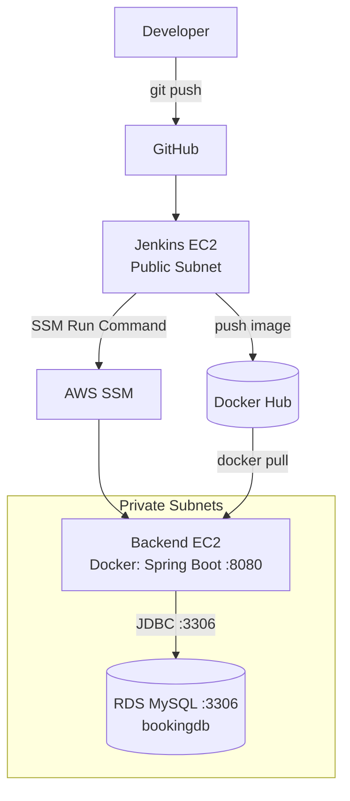
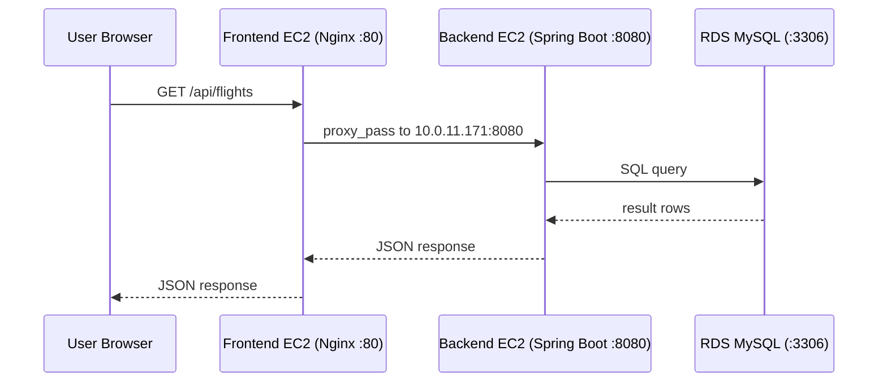
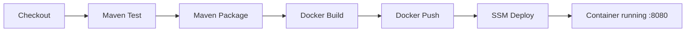

# FlightFinder Backend — AWS 3-Tier CI/CD Runbook


<p align="center">
  
</p>

> **Document type:** Operations runbook
> **Scope:** Backend build, release, verification, rollback, troubleshooting
> **Audience:** DevOps engineers, reviewers, interviewers

---

## Table of Contents

1. [Project Summary](#1-project-summary)
2. [Architecture](#2-architecture)
3. [Request Flow](#3-request-flow)
4. [CI/CD Pipeline](#4-cicd-pipeline)
5. [AWS Network and Resources](#5-aws-network-and-resources)
6. [Repository and Build](#6-repository-and-build)
7. [Dockerfile](#7-dockerfile)
8. [Jenkins Setup](#8-jenkins-setup)
9. [Jenkinsfile](#9-jenkinsfile)
10. [Deployment via AWS SSM](#10-deployment-via-aws-ssm)
11. [Verification](#11-verification)
12. [Rollback](#12-rollback)
13. [Troubleshooting](#13-troubleshooting)
14. [Security and Hardening](#14-security-and-hardening)
15. [Checklists](#15-checklists)
16. [Project Explanation](#16-project-explanation)

---

## 1. Project Summary

FlightFinder Backend is a **Spring Boot (Java 21)** REST API that runs in a Docker container on a **private EC2 instance** and stores data in **Amazon RDS MySQL**.

| Objective | How it is achieved |
| --- | --- |
| Source control | GitHub (`main` branch) |
| Automation | Jenkins pipeline |
| Build and test | Maven Wrapper (`./mvnw`) |
| Packaging | Multi-stage Docker image |
| Registry | Docker Hub |
| Deployment | AWS Systems Manager (SSM) Run Command, no SSH |
| Runtime | Container on private backend EC2, port `8080` |
| Data | RDS MySQL, port `3306`, database `bookingdb` |

---

## 2. Architecture



The backend EC2 has **no public IP**. Jenkins reaches it through SSM, so port 22, SSH keys, and a bastion host are not needed.

---

## 3. Request Flow

How a live user request reaches the backend and returns. The frontend Nginx proxies `/api/*` to the backend's private IP (see the frontend runbook).



| Layer | Exposure | Allowed inbound |
| --- | --- | --- |
| Frontend EC2 | Public | Internet on 80 |
| Backend EC2 | Private | Frontend security group on 8080 |
| RDS MySQL | Private | Backend security group on 3306 |

---

## 4. CI/CD Pipeline



| Stage | Command / action |
| --- | --- |
| Checkout | Clone `main` |
| Maven Build & Test | `./mvnw clean test` |
| Package JAR | `./mvnw clean package -DskipTests` |
| Docker Build | Tag `:<BUILD_NUMBER>` and `:latest` |
| Docker Login & Push | Push both tags to Docker Hub |
| Deploy via SSM | Pull, stop, remove, run new container on backend EC2 |

---

## 5. AWS Network and Resources

**Region:** `ap-south-1`  **VPC CIDR:** `10.0.0.0/16`

| Subnet type | CIDRs | Used for |
| --- | --- | --- |
| Public | `10.0.1.0/24`, `10.0.2.0/24` | Jenkins, frontend |
| Private application | `10.0.11.0/24`, `10.0.12.0/24` | Backend EC2 |
| Private database | `10.0.21.0/24`, `10.0.22.0/24` | RDS MySQL |

| Resource | Value |
| --- | --- |
| Backend instance ID | `i-04e08bcedc0870665` |
| Backend private IP | `10.0.11.171` |
| Backend port | `8080` |
| OS | Ubuntu |
| RDS identifier | `devops-mysql` |
| Database | `bookingdb` |
| Engine / port | MySQL / `3306` |
| Jenkins IAM role | `jenkins-ec2-role` |

`http://10.0.11.171:8080` is intentionally **not** reachable from the internet.

---

## 6. Repository and Build

| Item | Value |
| --- | --- |
| Repository | `https://github.com/ajaydhadi95-gif/FlightFinder-Application_backend.git` |
| Branch | `main` |
| Stack | Java 21, Spring Boot, Maven |

```text
backend/
├── src/main/{java,resources}/
├── .mvn/
├── mvnw, mvnw.cmd
├── pom.xml
├── Dockerfile
├── Jenkinsfile
├── .gitignore
└── RUNBOOK.md
```

**Maven (via wrapper, no global Maven needed)**

```bash
./mvnw clean test                      # run tests
./mvnw clean package -DskipTests       # build target/backend-0.0.1-SNAPSHOT.jar
```

**Git hygiene.** Generated files must not be committed. `.gitignore`:

```gitignore
target/
bin/
*.class
```

If `bin/` was already tracked: `git rm -r --cached bin`, then commit and push.

---

## 7. Dockerfile

```dockerfile
FROM eclipse-temurin:21-jdk-alpine AS build
WORKDIR /app
COPY .mvn/ .mvn/
COPY mvnw pom.xml ./
RUN sed -i 's/\r$//' mvnw && chmod +x mvnw
RUN ./mvnw -q dependency:go-offline
COPY src ./src
RUN ./mvnw -q clean package -DskipTests

FROM eclipse-temurin:21-jre-alpine
WORKDIR /app
RUN addgroup -S appgroup && adduser -S appuser -G appgroup
COPY --from=build /app/target/*.jar app.jar
RUN chown appuser:appgroup app.jar
USER appuser
EXPOSE 8080
ENTRYPOINT ["java", "-jar", "app.jar"]
```

| Part | Why |
| --- | --- |
| JDK build stage | Compiles the app and produces the JAR |
| JRE runtime stage | Smaller final image; runtime only |
| `sed -i 's/\r$//' mvnw` | Fixes Windows line endings so `mvnw` runs on Linux |
| `dependency:go-offline` | Caches dependencies in their own layer for faster rebuilds |
| `USER appuser` | Runs as non-root for better security |

**Image:** `ajaydhadi95/flightfinder-backend` with tags `<BUILD_NUMBER>` (for example `:4`) and `latest`.

---

## 8. Jenkins Setup

**Jenkins server (EC2):** Jenkins, Java, Git, Docker, AWS CLI.

| Check | Command | Expected |
| --- | --- | --- |
| Docker access for Jenkins | `sudo -u jenkins docker ps` | Lists containers, no permission error |
| AWS identity | `aws sts get-caller-identity` | Shows the `jenkins-ec2-role` identity |

**Credential:** `dockerhub-credentials` (username `ajaydhadi95`, password = Docker Hub **access token**).

**Why an IAM role.** Jenkins uses the EC2 instance role, so no AWS access keys are stored in Jenkins or in Git.

**Required SSM permissions on the role**

```text
ssm:SendCommand
ssm:GetCommandInvocation
ssm:ListCommandInvocations
ssm:ListCommands
ssm:DescribeInstanceInformation
```

**Backend EC2 requirements**

- SSM Agent installed and running, and registered as a managed instance
- Instance profile that allows SSM (for example `AmazonSSMManagedInstanceCore`)
- Outbound path to SSM endpoints (NAT gateway or VPC endpoints)
- Docker installed (first deployment failed with `docker: not found` until it was installed)

```bash
docker --version                 # Docker version 29.1.3
systemctl is-active docker       # active
```

> A `permission denied ... Docker API` error for the `ubuntu` user on the Jenkins server is a local group issue (`sudo usermod -aG docker ubuntu`, then log out and in). It is not a deployment failure.

---

## 9. Jenkinsfile

```groovy
pipeline {
    agent any

    environment {
        IMAGE_NAME          = 'ajaydhadi95/flightfinder-backend'
        IMAGE_TAG           = "${BUILD_NUMBER}"
        BACKEND_INSTANCE_ID = 'i-04e08bcedc0870665'
        AWS_REGION          = 'ap-south-1'
        DOCKER_CREDENTIALS  = 'dockerhub-credentials'
    }

    stages {
        stage('Checkout') {
            steps {
                git branch: 'main',
                    url: 'https://github.com/ajaydhadi95-gif/FlightFinder-Application_backend.git'
            }
        }

        stage('Maven Build & Test') {
            steps {
                sh '''
                    chmod +x mvnw
                    ./mvnw clean test
                '''
            }
        }

        stage('Package JAR') {
            steps {
                sh './mvnw clean package -DskipTests'
            }
        }

        stage('Docker Build') {
            steps {
                sh '''
                    docker build \
                      -t ${IMAGE_NAME}:${IMAGE_TAG} \
                      -t ${IMAGE_NAME}:latest \
                      .
                '''
            }
        }

        stage('Docker Login & Push') {
            steps {
                withCredentials([usernamePassword(
                    credentialsId: "${DOCKER_CREDENTIALS}",
                    usernameVariable: 'DOCKER_USER',
                    passwordVariable: 'DOCKER_PASSWORD')]) {
                    sh '''
                        echo "$DOCKER_PASSWORD" | docker login \
                            -u "$DOCKER_USER" --password-stdin
                        docker push ${IMAGE_NAME}:${IMAGE_TAG}
                        docker push ${IMAGE_NAME}:latest
                    '''
                }
            }
        }

        stage('Deploy to Backend via SSM') {
            steps {
                script {
                    def commandId = sh(
                        script: """
                            aws ssm send-command \
                              --instance-ids "${BACKEND_INSTANCE_ID}" \
                              --document-name "AWS-RunShellScript" \
                              --parameters 'commands=[
                                "docker pull ${IMAGE_NAME}:${IMAGE_TAG}",
                                "docker stop flightfinder-backend || true",
                                "docker rm flightfinder-backend || true",
                                "docker run -d --name flightfinder-backend --restart unless-stopped -p 8080:8080 ${IMAGE_NAME}:${IMAGE_TAG}"
                              ]' \
                              --region ${AWS_REGION} \
                              --query 'Command.CommandId' \
                              --output text
                        """,
                        returnStdout: true
                    ).trim()

                    echo "SSM Command ID: ${commandId}"
                    sleep 10

                    sh """
                        aws ssm get-command-invocation \
                          --command-id "${commandId}" \
                          --instance-id "${BACKEND_INSTANCE_ID}" \
                          --region "${AWS_REGION}"
                    """
                }
            }
        }
    }

    post {
        success { echo 'Backend deployment successful!' }
        failure { echo 'Backend deployment failed!' }
    }
}
```

---

## 10. Deployment via AWS SSM

Jenkins sends these commands to the backend instance using `AWS-RunShellScript`:

```bash
docker pull ajaydhadi95/flightfinder-backend:${BUILD_NUMBER}
docker stop flightfinder-backend || true
docker rm flightfinder-backend || true
docker run -d \
  --name flightfinder-backend \
  --restart unless-stopped \
  -p 8080:8080 \
  ajaydhadi95/flightfinder-backend:${BUILD_NUMBER}
```

**Why `|| true`?** On the first deployment the container does not exist, so `docker stop` and `docker rm` would fail with `No such container` and abort the script. `|| true` makes those steps safe to repeat.

**Why `--restart unless-stopped`?** The container comes back automatically after a reboot or crash.

---

## 11. Verification

**In Jenkins:** all six stages green and the SSM invocation shows `Status: Success`.

**On the backend (via SSM Session Manager):**

```bash
docker ps                                  # flightfinder-backend, 0.0.0.0:8080->8080/tcp
docker logs --tail 100 flightfinder-backend
curl http://localhost:8080/api/test        # FlightFinder Backend is running!
```

**From the frontend EC2:**

```bash
curl http://10.0.11.171:8080/api/test
```

**End to end (from anywhere):**

```bash
curl http://<FRONTEND_PUBLIC_IP>/api/flights
```

---

## 12. Rollback

Each build is an immutable tag, so rolling back means running an earlier tag. To revert from build 5 to build 4, run on the backend (Session Manager or SSM Run Command):

```bash
docker pull ajaydhadi95/flightfinder-backend:4
docker stop flightfinder-backend
docker rm flightfinder-backend
docker run -d \
  --name flightfinder-backend \
  --restart unless-stopped \
  -p 8080:8080 \
  ajaydhadi95/flightfinder-backend:4
docker ps
```

---

## 13. Troubleshooting

| Symptom | Likely cause | Fix |
| --- | --- | --- |
| `docker: not found` on backend | Docker not installed | Install Docker, verify `docker --version` and `systemctl is-active docker` |
| Jenkins `permission denied` on Docker | `jenkins` not in `docker` group | `sudo usermod -aG docker jenkins`, restart Jenkins |
| `aws sts get-caller-identity` fails | Instance role missing or detached | Attach `jenkins-ec2-role` to the Jenkins EC2 |
| `AccessDenied` on `ssm:SendCommand` | Missing IAM permission | Add the SSM permissions listed in section 8 |
| Instance not in SSM | Agent stopped, no instance profile, or no outbound route | Start the agent, attach SSM profile, check NAT or VPC endpoints |
| SSM status `Failed` | Command error on the instance | Read stdout and stderr from `get-command-invocation` |
| Container exits right after start | App cannot reach RDS or bad config | `docker logs flightfinder-backend`; check RDS security group allows the backend on 3306 |
| `Connection refused` on 8080 | Container down or port not mapped | `docker ps`; confirm `-p 8080:8080`; check backend security group |
| `./mvnw: not found` or bad interpreter in Docker build | Windows line endings | Already handled by `sed -i 's/\r$//' mvnw` |
| Build pushes generated files | `.gitignore` incomplete | Add `target/`, `bin/`, `*.class`; `git rm -r --cached` |

---

## 14. Security and Hardening

Already in place: private backend with no public IP, SSM instead of SSH, IAM role instead of stored keys, Docker Hub access token, non-root container user, multi-stage image.

Recommended next steps:

- **Database credentials.** The `docker run` command passes no configuration, so the JDBC URL and password must come from somewhere. Do not bake them into the image or Git; inject them at run time from AWS Secrets Manager or SSM Parameter Store.
- **Wait for SSM properly.** Replace `sleep 10` with `aws ssm wait command-executed`, then fail the build if the status is not `Success`. Otherwise the pipeline can report success while the command is still running.
- **Health check.** Add a stage that curls `/api/test` (or a Spring Boot Actuator health endpoint) after deploy and fails on error.
- **Skip the duplicate build.** The Dockerfile already compiles the JAR, so the Jenkins `Package JAR` stage is redundant unless you archive the JAR.
- **Pin tags in deployment.** Deploy by build number (as done), not `latest`, so releases are reproducible.
- **Next architecture step.** Place an Application Load Balancer in front of the backend, then run it across multiple AZs.

---

## 15. Checklists

**Before deployment**

- [ ] Code merged to `main`; tests pass locally
- [ ] `.gitignore` excludes `target/`, `bin/`, `*.class`
- [ ] Jenkins is up; `sudo -u jenkins docker ps` works
- [ ] `dockerhub-credentials` is valid (token not expired)
- [ ] Jenkins IAM role has the SSM permissions
- [ ] Backend EC2 is `Online` in SSM and Docker is active
- [ ] RDS is available; security groups allow 8080 and 3306 as intended

**After deployment**

- [ ] Jenkins build `SUCCESS`; SSM invocation `Success`
- [ ] New image tag visible on Docker Hub
- [ ] Container running on backend EC2
- [ ] `/api/test` and `/api/flights` respond
- [ ] No errors in `docker logs`

---

## 16. Project Explanation

**Short version**

> I built a CI/CD pipeline for a Spring Boot backend on AWS. A push to GitHub triggers Jenkins, which runs Maven tests, builds a multi-stage Docker image, and pushes a versioned tag to Docker Hub. Jenkins then deploys through AWS Systems Manager to a private EC2 instance, so there is no SSH and no public IP on the backend. The container listens on port 8080 and connects to an RDS MySQL database in a private subnet. Jenkins authenticates to AWS with an IAM role, so no access keys are stored anywhere.

**Key talking points**

| Topic | Point |
| --- | --- |
| Why SSM instead of SSH | No open port 22, no key management, access controlled and audited through IAM |
| Why an IAM role | No long-lived AWS keys in Jenkins |
| Why multi-stage Docker | Small runtime image, JDK not shipped to production |
| Why non-root user | Limits impact if the container is compromised |
| Why versioned tags | Traceable releases and one-command rollback |
| Why private subnets | Backend and DB are never directly exposed to the internet |

**One line:** GitHub-to-Jenkins-to-Docker Hub pipeline that deploys a Spring Boot backend to a private EC2 through AWS SSM, backed by RDS MySQL.
